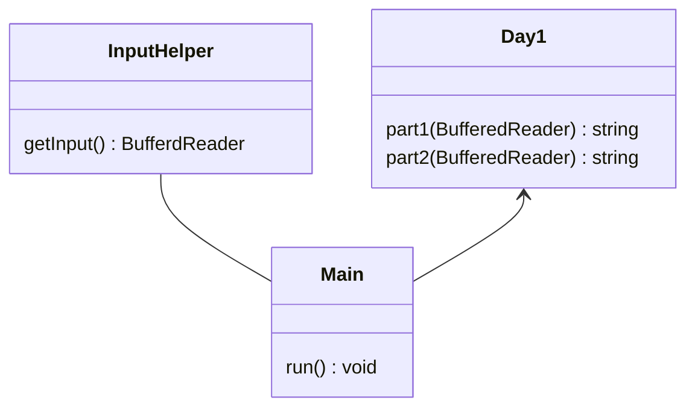

# Advent Of Code 2022

This repository contains my solutions to the [Advent of Code 2022](https://adventofcode.com/2022) challenges.

## Usage

To run the solutions, you need to have **Java 17** installed.
You can then run the solutions with the following command:

In addition you need to set the `AOC_TOKEN` environment variable to your session cookie.

```bash
./gradlew run
```

All solutions can be tested on example inputs via:

```bash
./gradlew test
```

## License

This project is licensed under the GGPLv3 License - see the [LICENSE](LICENSE) file for details

### Logic



